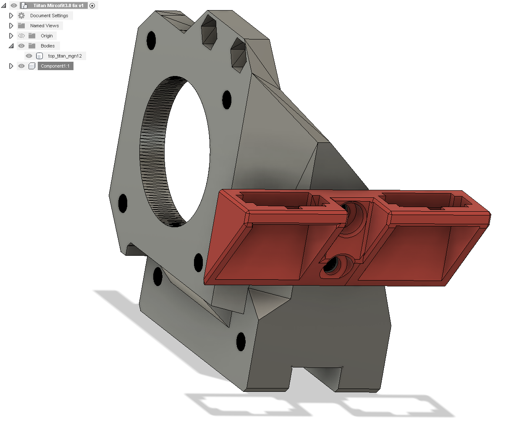

> Created by: [StefanIGit]

Addon to add 2x Micro-Fit 3.0 Plug Housings to a Titan extruder.
Make sure you get the female socket with the laches on the sides (Panel Mount Ears)

[src Fusion360](stl/Titan_Mircofit3.0_6x_v1.f3d)

| No | Qty | Name                                           | Printable |
| -- | --- | ---------------------------------------------- | --------- |
| 1  | 2   | M3 x 8mm                                       | No        |
| 2  | 2   | M3 Hen nuts                                    | No        |
| 3  | 1   | Holder                                         | [Yes](stl/Holder.stl)      |
| 4  | 2   | Female socket | [No](https://www.molex.com/molex/products/part-detail/crimp_housings/0430200810) / [No](https://www.amazon.com/Molex-8-Pin-Connector-4-20mm-0165-Mini-Fit/dp/B07DXJ5556/ref=sr_1_18?dchild=1&keywords=Molex+Micro-Fit+3.0+Dual+Row&qid=1633197562&sr=8-18) |

